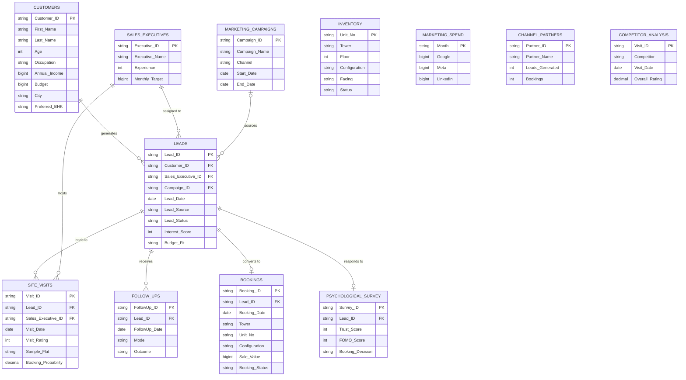

# Godrej Riverine Database ER Diagram

```mermaid
erDiagram
    CUSTOMERS ||--o{ LEADS : "generates"
    SALES_EXECUTIVES ||--o{ LEADS : "assigned to"
    MARKETING_CAMPAIGNS |o--o{ LEADS : "sources"
    LEADS ||--o{ SITE_VISITS : "leads to"
    SALES_EXECUTIVES ||--o{ SITE_VISITS : "hosts"
    LEADS ||--o{ FOLLOW_UPS : "receives"
    LEADS ||--o| BOOKINGS : "converts to"
    LEADS ||--o| PSYCHOLOGICAL_SURVEY : "responds to"

    CUSTOMERS {
        string Customer_ID PK
        string First_Name
        string Last_Name
        int Age
        string Occupation
        bigint Annual_Income
        bigint Budget
        string City
        string Preferred_BHK
    }

    LEADS {
        string Lead_ID PK
        string Customer_ID FK
        string Sales_Executive_ID FK
        string Campaign_ID FK
        date Lead_Date
        string Lead_Source
        string Lead_Status
        int Interest_Score
        string Budget_Fit
    }

    SITE_VISITS {
        string Visit_ID PK
        string Lead_ID FK
        string Sales_Executive_ID FK
        date Visit_Date
        int Visit_Rating
        string Sample_Flat
        decimal Booking_Probability
    }

    FOLLOW_UPS {
        string FollowUp_ID PK
        string Lead_ID FK
        date FollowUp_Date
        string Mode
        string Outcome
    }

    BOOKINGS {
        string Booking_ID PK
        string Lead_ID FK
        date Booking_Date
        string Tower
        string Unit_No
        string Configuration
        bigint Sale_Value
        string Booking_Status
    }

    SALES_EXECUTIVES {
        string Executive_ID PK
        string Executive_Name
        int Experience
        bigint Monthly_Target
    }

    MARKETING_CAMPAIGNS {
        string Campaign_ID PK
        string Campaign_Name
        string Channel
        date Start_Date
        date End_Date
    }

    PSYCHOLOGICAL_SURVEY {
        string Survey_ID PK
        string Lead_ID FK
        int Trust_Score
        int FOMO_Score
        string Booking_Decision
    }

    INVENTORY {
        string Unit_No PK
        string Tower
        int Floor
        string Configuration
        string Facing
        string Status
    }

    MARKETING_SPEND {
        string Month PK
        bigint Google
        bigint Meta
        bigint LinkedIn
    }

    CHANNEL_PARTNERS {
        string Partner_ID PK
        string Partner_Name
        int Leads_Generated
        int Bookings
    }

    COMPETITOR_ANALYSIS {
        string Visit_ID PK
        string Competitor
        date Visit_Date
        decimal Overall_Rating
    }
```
