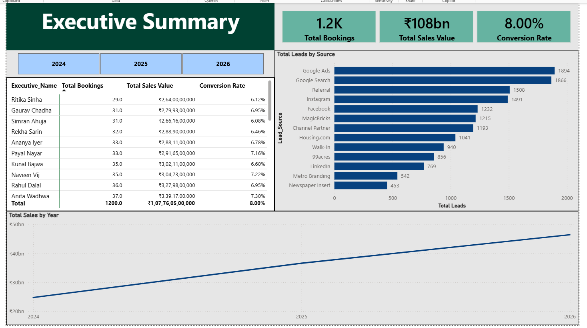
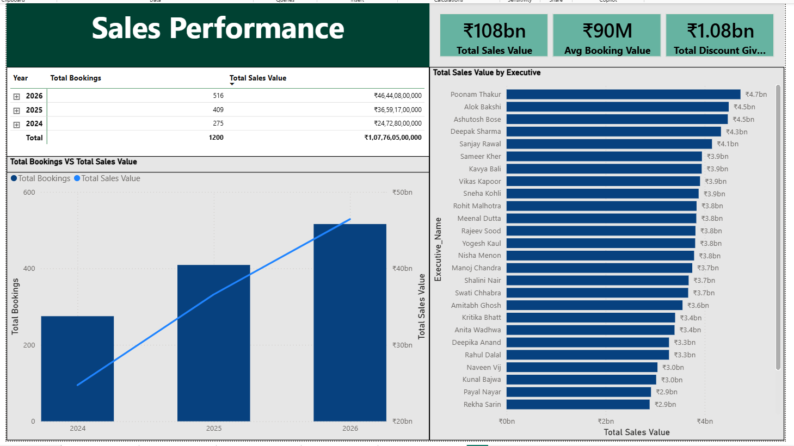
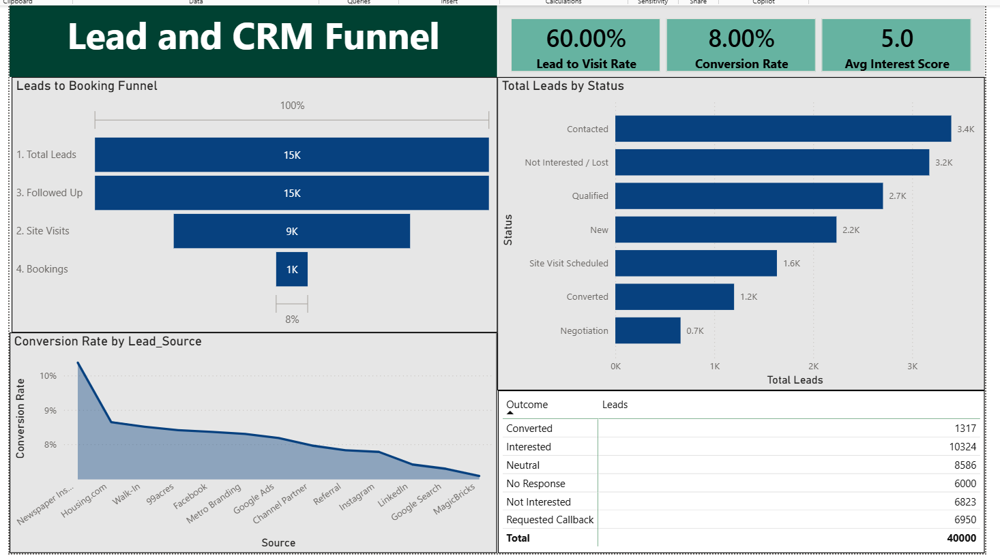
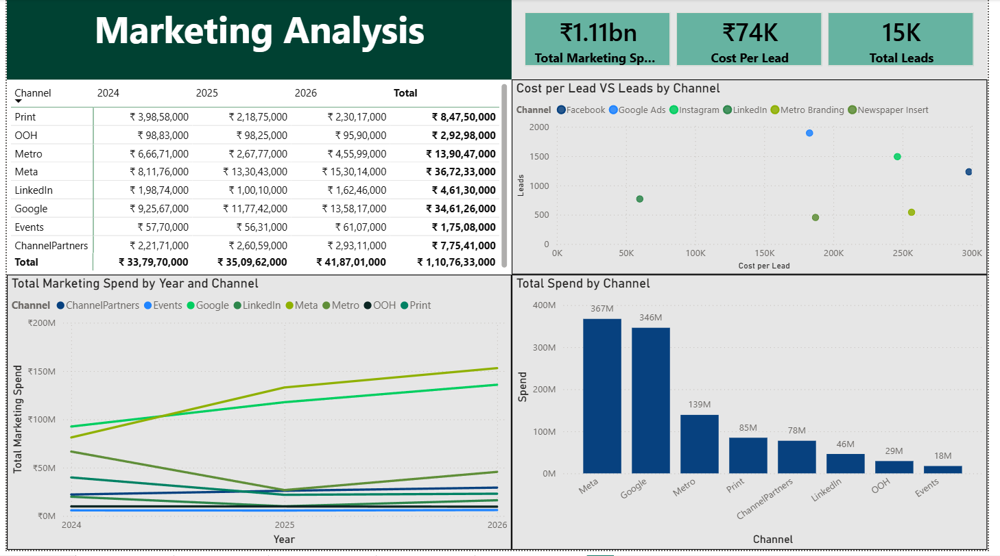
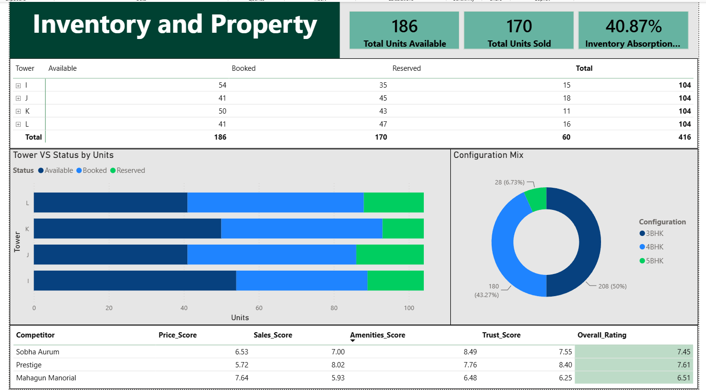

# Godrej Riverine — CRM, Marketing & Sales Analytics

An end-to-end Business Intelligence project simulating the CRM, Marketing, Sales, and Inventory
database of a real-estate project, built to mirror how a real analytics team would take raw data
from spreadsheets all the way to a decision-ready Power BI dashboard.

**Workflow:** Raw CSVs → Excel (cleaning, Power Query) → MySQL (modeling + analysis) → Power BI (star schema + dashboard) → Business Insights

---

## 📁 Repository Structure

```bash
Godrej-Riverine-Analytics/
│
├── README.md
│
├── data/
│   └── godrej_dataset/
│
├── sql/
│   ├── schema.sql
│   └── analysis_queries.sql
│
├── docs/
│   ├── data_dictionary.md
│   ├── erd.md
│   ├── business_requirements.md
│   └── business_insights.md
│
├── dashboard/
│   └── Godrej_Riverine_Dashboard.pbix
│
└── images/
    ├── executive_summary.png
    ├── sales_performance.png
    ├── crm_funnel.png
    ├── marketing_analysis.png
    └── inventory_property.png
```

---

## 🧩 Project Overview

Godrej Riverine is a luxury residential project (Sector 44, Noida) targeting HNI buyers with
3/4/5 BHK units. This project simulates the full sales lifecycle - lead generation, site visits,
follow-ups, bookings, and inventory, across three business functions (Sales, Marketing, CRM)
that in most companies live in disconnected spreadsheets.

The goal: build a single, queryable source of truth and a self-serve dashboard that answers
questions like *"which marketing channel gives us the cheapest cost-per-booking?"* or *"where
in the funnel are we losing the most leads?"* without anyone needing to manually pull numbers.

## 🗄️ Database Design

- 12 tables covering Customers, Leads, Site_Visits, Follow_Ups, Bookings, Inventory,
  Sales_Executives, Marketing_Campaigns, Marketing_Spend, Channel_Partners,
  Competitor_Analysis, and Psychological_Survey.
- Fully normalized with primary/foreign key constraints - see `04_SQL_schema.sql`.
- Full ER diagram in `02_Database_ERD.md`.

## 🔍 SQL Analysis Highlights

`05_SQL_analysis_queries.sql` demonstrates:
- **Joins** across the full funnel (Leads → Site Visits → Follow-Ups → Bookings)
- **CTEs** to break multi-stage funnel and marketing-spend logic into readable steps
- **Window functions** (`RANK()`, `ROW_NUMBER()`, `LAG()`, `SUM() OVER()`) for executive
  performance ranking, month-over-month revenue growth, and best-selling configuration by quarter

## 📊 Power BI Dashboard

5 pages, built on a star-schema data model with 15+ DAX measures:

1. **Executive Summary** - top-line KPIs across Sales, Marketing, CRM, and Inventory
   
   

  
  

2. **Sales Performance** - bookings, revenue trends, executive ranking, configuration mix  


  
  

3. **Lead & CRM Funnel** - funnel drop-off, lead status pipeline, follow-up effectiveness  


  
  

4. **Marketing Analysis** - channel spend, cost per lead, campaign ROI  


  
  

5. **Inventory & Property** - unit status by tower, absorption rate, competitor benchmarking  


  
  

Includes slicers, a custom tooltip page, a drill-through executive detail page, and a
bookmark-driven reset button.

## 💡 Business Insights

10 insights written in Business Analyst format (What happened → Why → Impact →
Recommendation), covering lead conversion, funnel drop-off, executive performance, marketing
ROI, inventory absorption, and competitive positioning. Full write-up in
`07_Business_Insights.md`.

## 🛠️ Tools Used

- **Excel & Power Query** - data cleaning, profiling, initial pivot analysis
- **MySQL** - database design, normalization, advanced querying
- **Power BI** - star schema modeling, DAX, interactive dashboard design

## 📬 Contact

Built by **Shreyansh** as a Business Analyst / Data Analyst portfolio project.
Feel free to reach out or connect on LinkedIn.
